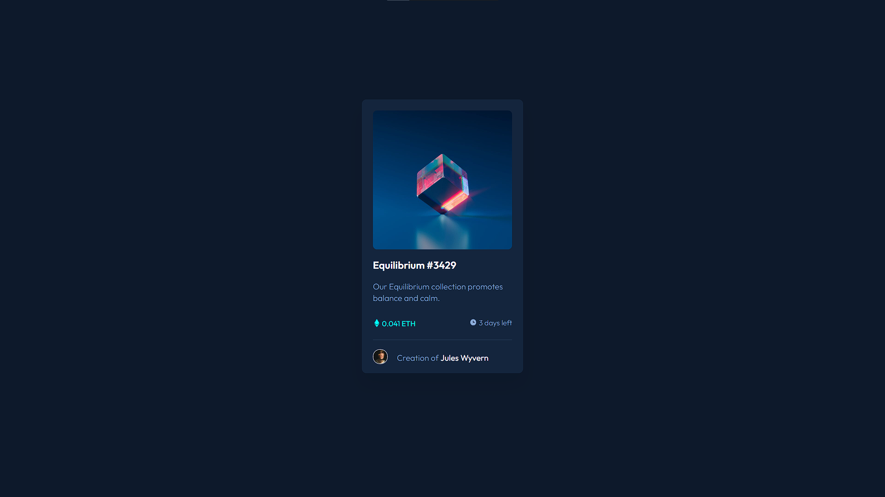
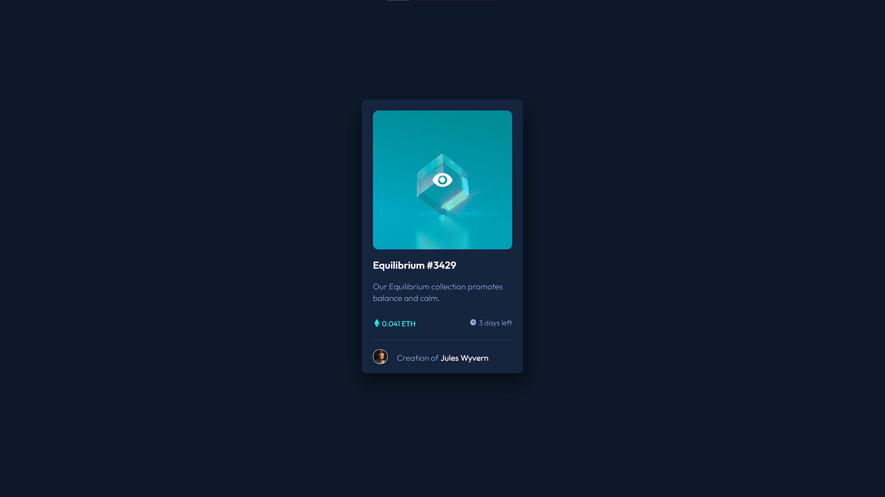

# Frontend Mentor - NFT preview card component solution

This is a solution to the [NFT preview card component challenge on Frontend Mentor](https://www.frontendmentor.io/challenges/nft-preview-card-component-SbdUL_w0U). Frontend Mentor challenges help you improve your coding skills by building realistic projects. 

## Table of contents

- [Overview](#overview)
  - [The challenge](#the-challenge)
  - [Screenshot](#screenshot)
  - [Links](#links)
- [My process](#my-process)
  - [Built with](#built-with)
  - [What I learned](#what-i-learned)
  - [Useful resources](#useful-resources)
- [Author](#author)

## Overview

### The challenge

Users should be able to:

- View the optimal layout depending on their device's screen size
- See hover states for interactive elements

### Screenshot

##### Desktop design

##### Desktop design active state

##### Mobile design


### Links

- Solution URL: [https://github.com/doomware/ntf-preview-card](https://github.com/doomware/ntf-preview-card)
- Live Site URL: [https://doomware.github.io/ntf-preview-card/](https://doomware.github.io/ntf-preview-card/)

## My process

### Built with

- Semantic HTML5 markup
- CSS custom properties
- Flexbox

### What I learned


With this challenge, try to do the best with the active states, especially with the preview icon in the image and the translucent aqua background, in addition to applying the responsive designs to the measurements provided.

This piece of code was key so that the outline of the icon image would not remove the aqua background while it was hovering.
```css
.icon-view:hover ~ .img-prev{
  opacity: 0.5;
}
```

### Useful resources

- [How TO - Image Overlay Icon](https://www.w3schools.com/howto/howto_css_image_overlay_icon.asp) - This article helped me to solve how to put the icon on the image to show it when the mouse is positioned on it.
- [Using media queries](https://developer.mozilla.org/en-US/docs/Web/CSS/Media_Queries/Using_media_queries) - This article helped me to remember how to make the page responsive
- [CSS Combinators](https://www.w3schools.com/css/css_combinators.asp) - This solved the problem that I mentioned in the section [What I learned](#what-i-learned)

## Author

- Frontend Mentor - [@doomware](https://www.frontendmentor.io/profile/doomware)
- Twitter - [@d00mwar3](https://twitter.com/d00mwar3)

